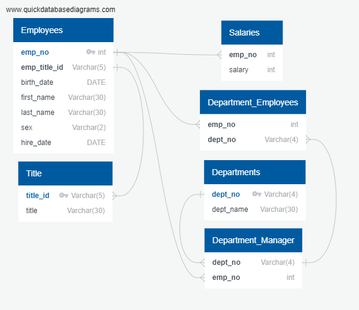

# SQL-Challenge

Research project about people whom the company employed during the 1980s and 1990s out of 6 available CSVs. Design the tables to hold the data from the CSV files, import the CSV files into a SQL database, and then answer questions about the data. That is, you’ll perform data modeling, data engineering, and data analysis, respectively.
